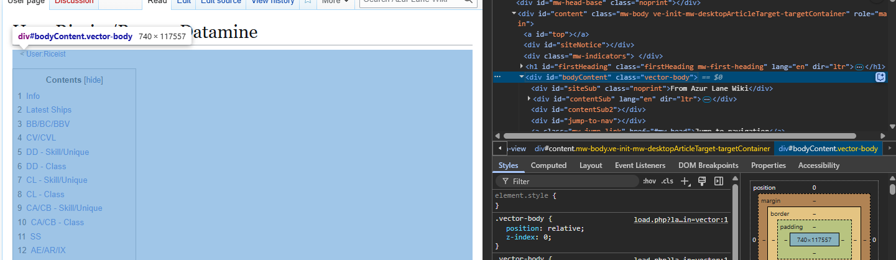

# al-barrage-datamine

Tools to barrage datamine. Mainly for Azur Lane Wiki usage.

## Requirements

- Python 3.11 or higher

## Installation

This pulls information from Riceist's barrage datamine here: [User:Riceist/BarrageDatamine](https://azurlane.koumakan.jp/wiki/User:Riceist/BarrageDatamine)

You need to inspect element and copy this part of the webpage, then paste it into `src/riceist.html`



All you need to do is run

```bash
bash run.sh
```

Then, copy over the data and data2 modules within the "output" folder to their
respective wiki pages:

- [Module:ShipBarrage/data](https://azurlane.koumakan.jp/wiki/Module:ShipBarrage/data)
- [Module:ShipBarrage/data2](https://azurlane.koumakan.jp/wiki/Module:ShipBarrage/data2)
